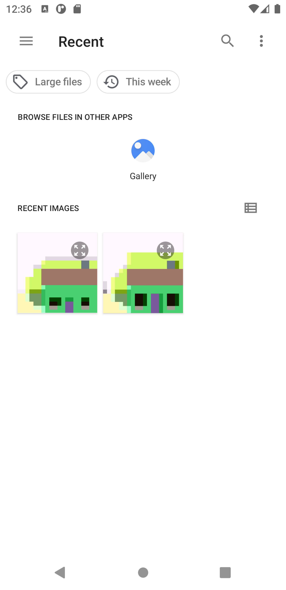
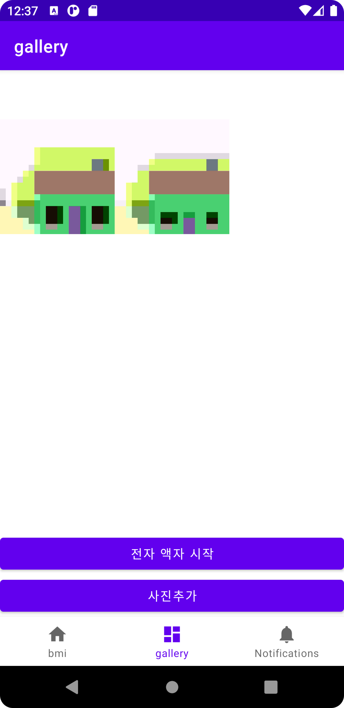
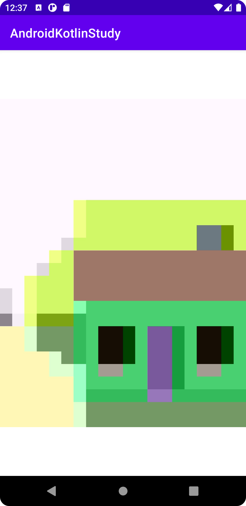

Android-Kotlin-Study

- 코틀린을 통한 안드로이드 스터디 하며, 진행한 실습 프로젝트 정리
- bottom navigation으로 각 실습 프로젝트 구분

## 활용 기능
- bmi 계산기
    - strings 다국어 처리
    - button onClick 이벤트 처리
    - fragment, linearLayout, textView ...
    - activity 전환 / putExtra, getExtra
    -  
- 전자액자
    - 갤러리 권한 사용하여 이미지 업로드
      - READ_EXTERNAL_STORAGE
    - constraintLayout, imageView ...
    - animate() 사용하여 이미지 전환
    -   
- TBD ...
